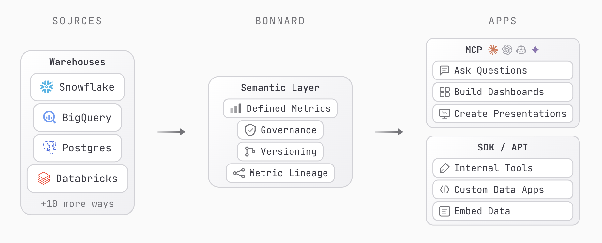

<p align="center">
  <a href="https://www.bonnard.dev">
    <picture>
      <source media="(prefers-color-scheme: dark)" srcset="./assets/banner-dark.png" />
      <source media="(prefers-color-scheme: light)" srcset="./assets/banner-light.png" />
      
    </picture>
  </a>
</p>

<p align="center">
  <strong>Agent-native analytics. One schema, many surfaces.</strong>
</p>

<p align="center">
  <a href="https://www.npmjs.com/package/@bonnard/cli"></a>
  <a href="https://github.com/meal-inc/bonnard-cli/blob/main/LICENSE"></a>
  <a href="https://discord.com/invite/RQuvjGRz"></a>
</p>

<p align="center">
  <a href="https://docs.bonnard.dev/docs/">Docs</a> &middot;
  <a href="https://docs.bonnard.dev/docs/getting-started">Getting Started</a> &middot;
  <a href="https://docs.bonnard.dev/docs/changelog">Changelog</a> &middot;
  <a href="https://discord.com/invite/RQuvjGRz">Discord</a> &middot;
  <a href="https://www.bonnard.dev">Website</a>
</p>

---

BI tools serve one UI. Bonnard serves everything. Agents over MCP, apps over SDK, dashboards in markdown, internal tools via REST. One set of metric definitions, every consumer gets the same governed answer.

<p align="center">
  
</p>
## Why Bonnard?

Traditional semantic layers were built for dashboards and retrofitted for AI. Agents get different answers than dashboards, metrics drift across tools, and every new surface means another integration. Bonnard was built agent-native from day one. MCP is a core feature, not a plugin. One CLI, one schema, every consumer gets the same governed answer.

## Quick Start

No install required. Run directly with npx:

```bash
npx @bonnard/cli init
```

Or install globally:

```bash
npm install -g @bonnard/cli
```

Then follow the setup flow:

```bash
bon init                      # Scaffold project + agent configs
bon datasource add            # Connect your warehouse
bon validate                  # Check your models locally
bon login                     # Authenticate
bon deploy -m "initial deploy" # Ship it
```

Your semantic layer is now live. Agents, dashboards, and the SDK all query the same governed metrics.

No warehouse yet? Start exploring with a full retail demo dataset:

```bash
bon datasource add --demo
```

Requires Node.js 20+.

## What You Get

- **Agent context out of the box.** `bon init` generates rules and skills for [Claude Code, Cursor, and Codex](https://docs.bonnard.dev/docs/cli) so agents understand your semantic layer from the first prompt.
- **[MCP server](https://docs.bonnard.dev/docs/mcp)** for governed agent queries. Set up with `bon mcp`, test with `bon mcp test`.
- **[Markdown dashboards](https://docs.bonnard.dev/docs/dashboards)** with BigValue, LineChart, BarChart, AreaChart, PieChart, and DataTable components. Preview locally with `bon dashboard dev`, deploy with `bon dashboard deploy`.
- **[JSON and SQL querying](https://docs.bonnard.dev/docs/querying)** from the terminal via `bon query` and `bon schema`, or programmatically via the REST API.
- **Deployment versioning** with change tracking (`bon diff`), annotations (`bon annotate`), and full history (`bon deployments`).
- **CI/CD support.** Run `bon deploy --ci -m "message"` for non-interactive pipelines.

## Supported Data Sources

**Warehouses:** Snowflake (including Snowpark), Google BigQuery, Databricks (SQL warehouses and Unity Catalog), PostgreSQL (including Supabase, Neon, and RDS), Amazon Redshift, DuckDB (including MotherDuck)

**Data tools:** dbt (model and profile import), Dagster, Prefect, Airflow (orchestration), Looker, Cube, Evidence (existing BI layers), SQLMesh, Soda, Great Expectations (data quality)

Bonnard auto-detects your warehouses and data tools. Point it at your project and it discovers schemas, tables, and relationships.

## Ecosystem

- **[@bonnard/sdk](https://www.npmjs.com/package/@bonnard/sdk)**: query the semantic layer from any JavaScript or TypeScript application
- **[@bonnard/react](https://www.npmjs.com/package/@bonnard/react)**: React chart components and a markdown dashboard viewer

## Commands

| Command | Description |
| --- | --- |
| `bon init` | Scaffold a new project with agent configs |
| `bon datasource add` | Connect a data source (or `--demo` for sample data) |
| `bon validate` | Validate YAML syntax locally |
| `bon deploy -m "message"` | Deploy to production |
| `bon pull` | Download deployed models to local project |
| `bon query` | Run queries (JSON or SQL) |
| `bon schema` | Explore deployed measures, dimensions, and views |
| `bon dashboard dev` | Preview a markdown dashboard locally |
| `bon dashboard deploy` | Deploy a dashboard |
| `bon mcp` | MCP server setup instructions |
| `bon keys create` | Create a publishable or secret API key |
| `bon docs` | Browse documentation from the CLI |

See the full [CLI reference](https://docs.bonnard.dev/docs/cli) for all commands and flags.

## Documentation

| Guide | Description |
| --- | --- |
| [Getting Started](https://docs.bonnard.dev/docs/getting-started) | From zero to deployed in minutes |
| [CLI Reference](https://docs.bonnard.dev/docs/cli) | Every command, flag, and option |
| [Modeling Guide](https://docs.bonnard.dev/docs/modeling/cubes) | Cubes, views, metrics, and dimensions |
| [Dashboards](https://docs.bonnard.dev/docs/dashboards) | Markdown dashboards with charts, inputs, and theming |
| [SDK](https://docs.bonnard.dev/docs/sdk) | TypeScript SDK and React components |
| [Querying](https://docs.bonnard.dev/docs/querying) | JSON and SQL query syntax |
| [Changelog](https://docs.bonnard.dev/docs/changelog) | What shipped and when |

## Community

- [Discord](https://discord.com/invite/RQuvjGRz): ask questions, share feedback, connect with the team
- [GitHub Issues](https://github.com/meal-inc/bonnard-cli/issues): bug reports and feature requests
- [LinkedIn](https://www.linkedin.com/company/bonnarddev/): follow for updates
- [Website](https://www.bonnard.dev): learn more about Bonnard

Contributions are welcome. If you find a bug or have an idea, open an issue or submit a pull request.
