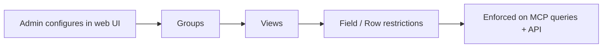

# Governance

> Control who can see which views, columns, and rows in your semantic layer.

Bonnard provides admin-managed data governance — control which views, columns, and rows each group of users can access. Policies are configured in the web UI and enforced automatically across MCP queries and the API. Changes take effect within one minute.

> **Building a B2B product?** Governance is for managing _internal_ user access via the dashboard. For tenant isolation in customer-facing apps (where each customer sees only their data), see [Security Context](access-control.security-context).

## How It Works

Governance uses **groups** as the unit of access. Each group has a set of **policies** that define which views its members can see, and optionally restrict specific columns or rows within those views.

## Groups

Groups represent teams or roles in your organization — "Sales Team", "Finance", "Executive". Create and manage groups from the **Governance** page in the Bonnard dashboard.

Each group has:
- **Name** and optional description
- **Color** for visual identification
- **View access** — which views the group can query
- **Members** — which users belong to the group

Users can belong to multiple groups. Their effective access is the **union** of all group policies.

## View-Level Access (Level 1)

The simplest control: toggle which views a group can see. Unchecked views are completely invisible to group members — they won't appear in `explore_schema` or be queryable.

From the group detail page, check the views you want to grant access to and click **Save changes**. New policies default to "All fields" with no row filters.

## Field-Level Access (Level 2)

Fine-tune which measures and dimensions a group can see within a view. Click the gear icon on any granted view to open the fine-tune dialog.

Three modes:
- **All fields** — full access to every measure and dimension (default)
- **Only these** — whitelist specific fields; everything else is hidden
- **All except** — blacklist specific fields; everything else is visible

Hidden fields are removed from the schema — they don't appear in `explore_schema` and can't be used in queries.

## Row-Level Filters (Level 2)

Restrict which rows a group can see. Add row filters in the fine-tune dialog to limit data by dimension values.

For example, filter `traffic_source` to `equals B2B, Organic` so the group only sees rows where traffic_source is B2B or Organic. Multiple values in a single filter are OR'd (any match). Multiple separate filters are AND'd (all must match).

Row filters are applied server-side on every query — users cannot bypass them.

## Members

Assign users to groups from the **Members** tab. Each user shows which groups they belong to and a preview of their effective access (which views they can query, any field or row restrictions).

Users without any group assignment see nothing — they must be added to at least one group to query governed views.

## How Policies Are Enforced

Policies configured in the web UI are stored in Supabase and injected into the query engine at runtime. When a user queries via MCP or the API:

1. Their JWT is enriched with group memberships
2. The query engine loads policies for those groups
3. View visibility, field restrictions, and row filters are applied automatically
4. The user only sees data their policies allow

No YAML changes are needed — governance is fully managed through the dashboard.

## Governance and Developer-Defined Policies

Governance policies from the dashboard are **merged** with any `access_policy` entries you define in your YAML model files. This lets you combine both approaches:

- **Developer-defined policies** — written in YAML, typically for B2B tenant isolation using `group: "*"` (matches all users, including SDK tokens)
- **Governance policies** — configured in the dashboard UI for internal user access control

When governance injects policies:

1. If a view has governance policies **and** developer-defined `access_policy` entries, both are merged into a single list
2. If a view has developer-defined `access_policy` but **no** governance policies, the developer entries are preserved as-is
3. If a view has **neither**, it receives a default policy restricting access to ungoverned users

This means you can safely define tenant isolation in YAML and layer dashboard governance on top — neither overwrites the other.

## Best Practices

1. **Start with broad access, then restrict** — give groups all views first, then fine-tune as needed
2. **Use groups for teams, not individuals** — easier to manage and audit
3. **Test with MCP** — after changing policies, query via MCP to verify the restrictions work as expected
4. **Review after schema deploys** — new views need to be added to group policies to become visible

## See Also

- [mcp](mcp) — How AI agents query your semantic layer
- [views](views) — Creating curated data views
- [access-control.security-context](access-control.security-context) — B2B multi-tenancy with security context
