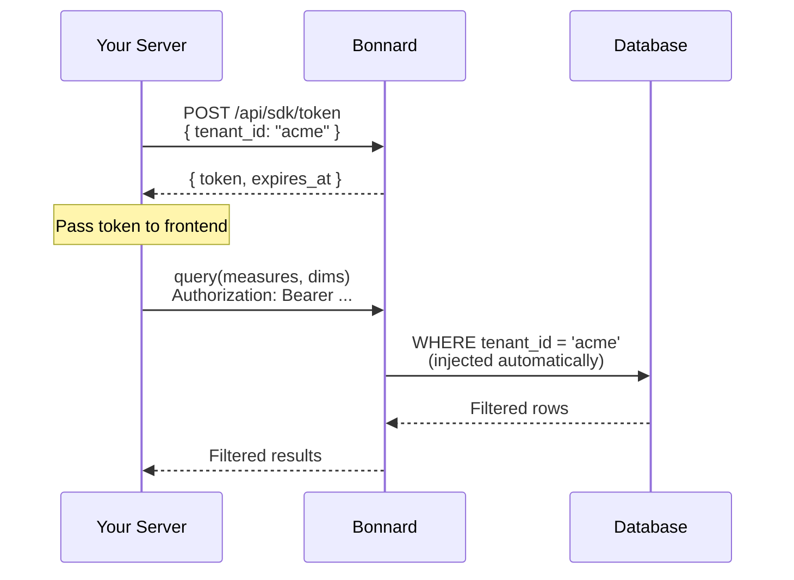

# Security Context

> Implement multi-tenant data isolation for B2B apps using security context and access policies.

Security context lets you build customer-facing applications where each tenant only sees their own data. It works through the SDK's token exchange mechanism — your server sets the context, and row-level filters are enforced automatically on every query.

## When to Use What

| Use case | Mechanism | Configured in |
|----------|-----------|---------------|
| Internal users — teams, roles, field/row restrictions | [Governance](access-control.governance) | Dashboard UI |
| B2B apps — each customer sees only their data | Security context | YAML model + SDK |
| Both — internal governance + tenant isolation | Both (merged) | Dashboard + YAML |

## How It Works



1. Your server calls `exchangeToken()` with a `security_context` containing tenant attributes
2. Bonnard returns a short-lived scoped token (5 min TTL, refreshable via `fetchToken`)
3. The frontend queries using that token — the query engine injects row-level filters from the `access_policy` matching `{securityContext.attrs.X}` values
4. Only matching rows are returned — tenants cannot see each other's data

## Step-by-Step Setup

### 1. Define access_policy in your view YAML

Add an `access_policy` entry with `group: "*"` (matches all users, including SDK tokens with empty groups) and a row-level filter referencing security context attributes:

```yaml
views:
  - name: orders
    cubes:
      - join_path: base_orders
        includes: "*"

    access_policy:
      - group: "*"
        row_level:
          filters:
            - member: tenant_id
              operator: equals
              values:
                - "{securityContext.attrs.tenant_id}"
```

The `{securityContext.attrs.tenant_id}` placeholder is replaced at query time with the value from the token's security context.

### 2. Deploy your model

```bash
bon deploy
```

### 3. Exchange a token server-side

In your API route or server action, exchange your secret key for a scoped token by calling the `/api/sdk/token` endpoint:

```typescript
// In your API route handler:
export async function GET(request: Request) {
  const tenantId = await getTenantFromSession(request);

  const res = await fetch('https://app.bonnard.dev/api/sdk/token', {
    method: 'POST',
    headers: {
      'Authorization': `Bearer ${process.env.BONNARD_SECRET_KEY}`,
      'Content-Type': 'application/json',
    },
    body: JSON.stringify({
      security_context: { tenant_id: tenantId },
    }),
  });

  const { token } = await res.json();
  return Response.json({ token });
}
```

### 4. Query from the frontend

```typescript
import { createClient } from '@bonnard/sdk';

const bonnard = createClient({
  fetchToken: async () => {
    const res = await fetch('/api/bonnard-token');
    const { token } = await res.json();
    return token;
  },
});

const result = await bonnard.query({
  measures: ['orders.revenue', 'orders.count'],
  dimensions: ['orders.status'],
});
// Only returns rows where tenant_id matches the exchanged context
```

## Multiple Filters

You can filter on multiple attributes. Each filter is AND'd:

```yaml
access_policy:
  - group: "*"
    row_level:
      filters:
        - member: tenant_id
          operator: equals
          values:
            - "{securityContext.attrs.tenant_id}"
        - member: region
          operator: equals
          values:
            - "{securityContext.attrs.region}"
```

```typescript
const res = await fetch('https://app.bonnard.dev/api/sdk/token', {
  method: 'POST',
  headers: {
    'Authorization': `Bearer ${process.env.BONNARD_SECRET_KEY}`,
    'Content-Type': 'application/json',
  },
  body: JSON.stringify({
    security_context: { tenant_id: 'acme', region: 'eu' },
  }),
});
const { token } = await res.json();
```

## Combining with Governance

Security context policies and governance policies are **merged**, not replaced. You can safely use both:

- `group: "*"` entries in YAML handle B2B tenant isolation (matches all users including SDK tokens)
- Governance policies from the dashboard handle internal user access control (field visibility, row filters by group)

When both are active on the same view, the final `access_policy` contains all entries. Cube evaluates them based on the user's group membership — SDK tokens have `groups: []`, so they match `group: "*"` but not named groups.

```yaml
# Developer-defined in YAML — always active
access_policy:
  - group: "*"
    row_level:
      filters:
        - member: tenant_id
          operator: equals
          values:
            - "{securityContext.attrs.tenant_id}"

# Governance adds these at runtime (configured in dashboard):
#  - group: sales
#    member_level:
#      includes: [revenue, count]
#  - group: finance
#    member_level:
#      includes: [margin, cost]
```

## Token Exchange Reference

**Endpoint:** `POST /api/sdk/token`

**Headers:** `Authorization: Bearer bon_sk_...` (your secret key)

| Body parameter | Type | Description |
|----------------|------|-------------|
| `security_context` | `Record<string, string>` | Key-value pairs. Keys must match `{securityContext.attrs.X}` placeholders in your access_policy. Max 20 keys, key max 64 chars, value max 256 chars. |
| `expires_in` | `number` | Token TTL in seconds. Min 60, max 3600, default 900. |

**Response:** `{ token: string, expires_at: string }`

**Token properties:**
- Default TTL: 15 minutes (configurable 1–60 min via `expires_in`)
- Renewable via `fetchToken` callback (SDK re-fetches automatically before expiry)
- Contains `groups: []` (empty) — matches `group: "*"` policies only

## See Also

- [access-control.governance](access-control.governance) — Dashboard-managed access control for internal users
- [sdk](sdk) — SDK query reference
- [syntax.context-variables](syntax.context-variables) — Context variable syntax reference
