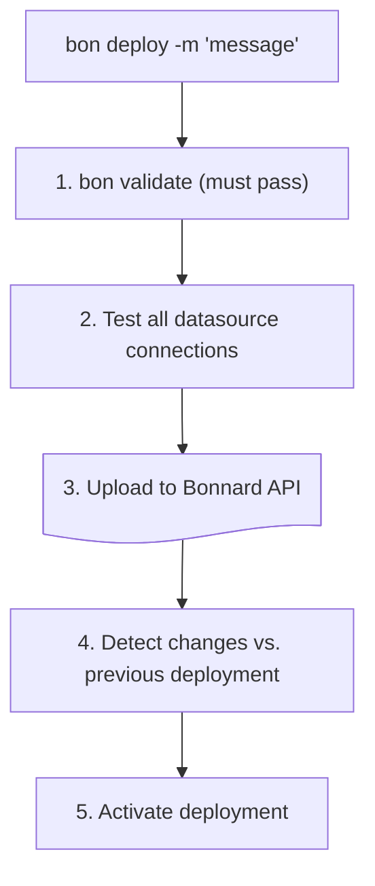

# Deploy

> Deploy your cubes and views to the Bonnard platform using the CLI. Once deployed, your semantic layer is queryable via the REST API, MCP for AI agents, and connected BI tools.

## Overview

The `bon deploy` command uploads your cubes and views to Bonnard, making them available for querying via the API. It validates and tests connections before deploying, and creates a versioned deployment with change detection.

## Usage

```bash
bon deploy -m "description of changes"
```

A `-m` message is **required** — it describes what changed in this deployment.

### Flags

| Flag | Description |
|------|-------------|
| `-m "message"` | **Required.** Deployment description |
| `--ci` | Non-interactive mode |

Datasources are always synced automatically during deploy.

### CI/CD

For automated pipelines, use `--ci` for non-interactive mode:

```bash
bon deploy --ci -m "CI deploy"
```

## Prerequisites

1. **Logged in** — run `bon login` first
2. **Valid cubes and views** — must pass `bon validate`
3. **Working connections** — data sources must be accessible

## What Happens

1. **Validates** — checks cubes and views for errors
2. **Tests connections** — verifies data source access
3. **Uploads** — sends cubes and views to Bonnard
4. **Detects changes** — compares against the previous deployment
5. **Activates** — makes cubes and views available for queries

## Example Output

```
bon deploy -m "Add revenue metrics"

✓ Validating...
  ✓ bonnard/cubes/orders.yaml
  ✓ bonnard/cubes/users.yaml
  ✓ bonnard/views/orders_overview.yaml

✓ Testing connections...
  ✓ datasource "default" connected

✓ Deploying to Bonnard...
  Uploading 2 cubes, 1 view...

✓ Deploy complete!

Changes:
  + orders.total_revenue (measure)
  + orders.avg_order_value (measure)
  ~ orders.count (measure) — type changed

⚠ 1 breaking change detected
```

## Change Detection

Every deployment is versioned. Bonnard automatically detects:

- **Added** — new cubes, views, measures, dimensions
- **Modified** — changes to type, SQL, format, description
- **Removed** — deleted fields (flagged as breaking)
- **Breaking changes** — removed measures/dimensions, type changes

## Reviewing Deployments

After deploying, use these commands to review history and changes:

### List deployments

```bash
bon deployments          # Recent deployments
bon deployments --all    # Full history
```

### View changes in a deployment

```bash
bon diff <deployment-id>              # All changes
bon diff <deployment-id> --breaking   # Breaking changes only
```

### Annotate changes

Add reasoning or context to deployment changes:

```bash
bon annotate <deployment-id> --data '{"object": "note about why this changed"}'
```

Annotations are visible in the schema catalog and help teammates understand why changes were made.

## Deploy Flow



## Error Handling

### Validation Errors

```
✗ Validating...

bonnard/cubes/orders.yaml:15:5
  error: Unknown measure type "counts"

Deploy aborted. Fix validation errors first.
```

### Connection Errors

```
✗ Testing connections...
  ✗ datasource "analytics": Connection refused

Deploy aborted. Fix connection issues:
  - Check credentials in .bon/datasources.yaml
  - Verify network access to database
  - Run: bon datasource add (to reconfigure)
```

### Auth Errors

```
✗ Not logged in.

Run: bon login
```

## What Gets Deployed

| Source | Deployed |
|--------|----------|
| `bonnard/cubes/*.yaml` | All cube definitions |
| `bonnard/views/*.yaml` | All view definitions |
| `.bon/datasources.yaml` | Connection configs (credentials encrypted) |
| `bon.yaml` | Project settings |

## Deployment Behavior

- **Replaces** previous deployment (not additive)
- **All or nothing** — partial deploys don't happen
- **Instant** — changes take effect immediately
- **Versioned** — every deployment is tracked with changes

## Best Practices

1. **Always include a meaningful message** — helps teammates understand what changed
2. **Validate first** — run `bon validate` before deploy
3. **Test locally** — verify queries work before deploying
4. **Use version control** — commit cubes and views before deploying
5. **Review after deploy** — use `bon diff` to check for unintended breaking changes
6. **Annotate breaking changes** — add context so consumers know what to update

## See Also

- cli
- cli.validate
- cubes
- views
